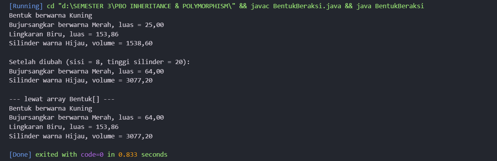
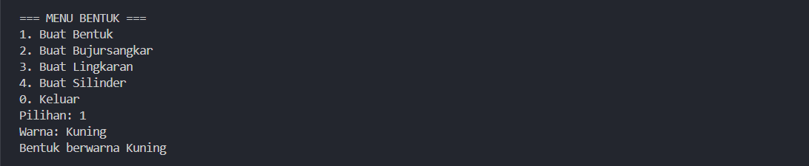
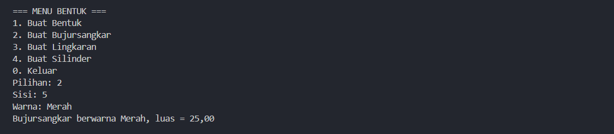
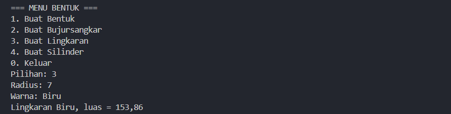
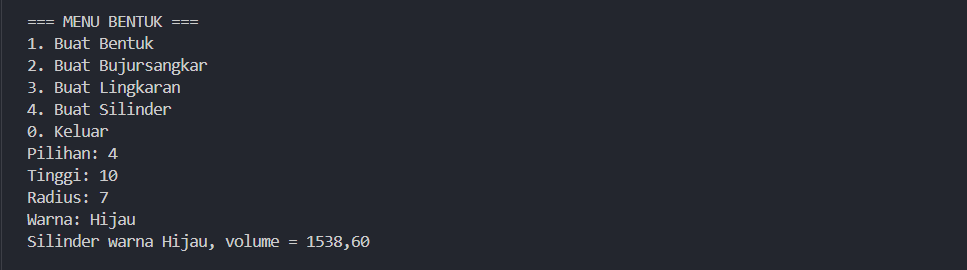

<<<<<<< HEAD
# Latihan PBO 5 - Inheritance dan Polymorphism

Tugas **3B - Latihan/Eksplorasi Materi Inheritance dan Polymorphism**
Mata Kuliah Pemrograman Berorientasi Objek (PBO)
Teknik Informatika, Universitas Mataram

## Identitas

| | |
|---|---|
| **NIM** | F1D02510042 |
| **Nama** | Baiq Nur Saqinah Kamila |
| **Kelas** | B |

---

## Deskripsi Singkat

Repositori ini berisi hasil **Latihan 1, 2, dan 3** pada materi **Inheritance** dan **Polymorphism** di Java:

1. **Latihan 1:** kelas `Bentuk` (induk) dan `BujurSangkar` (anak)
2. **Latihan 2:** kelas `Lingkaran` sebagai turunan `Bentuk`
3. **Latihan 3:** kelas `Silinder` sebagai turunan `Lingkaran`
4. Overriding method `printInfo()` pada setiap kelas turunan
5. Menu sederhana menggunakan `java.util.Scanner`

---

## Struktur Repositori

```
PBO-Inheritance-Polymorphism/
├── Bentuk.java
├── BujurSangkar.java
├── Lingkaran.java
├── Silinder.java
├── BentukBeraksi.java
├── Main.java
├── README.md
└── screenshots/
    ├── bentuk-beraksi.png
    ├── menu-bentuk.png
    ├── menu-bujursangkar.png
    ├── menu-lingkaran.png
    └── menu-silinder.png
```

## Daftar File

| File | Keterangan |
|------|------------|
| `Bentuk.java` | Kelas induk: atribut `warna`, `getWarna()`, `setWarna()`, `printInfo()` |
| `BujurSangkar.java` | Anak dari `Bentuk`: atribut `sisi`, `getSisi()`, `setSisi()`, `hitungLuas()`, `printInfo()` |
| `Lingkaran.java` | Anak dari `Bentuk`: atribut `radius`, konstanta `PHI`, `hitungLuas()`, `printInfo()` |
| `Silinder.java` | Anak dari `Lingkaran`: atribut `tinggi`, `hitungVolume()`, `printInfo()` |
| `BentukBeraksi.java` | Program uji pewarisan dan polymorphism |
| `Main.java` | Menu sederhana memakai `Scanner` |

---

## Library Tambahan

Tidak ada library eksternal. Program hanya memakai library bawaan Java:

- `java.util.Scanner` untuk membaca input dari keyboard

## Cara Menjalankan

**Prasyarat:**
- JDK sudah terpasang (cek dengan `java -version` dan `javac -version`)
- Visual Studio Code dengan ekstensi **Extension Pack for Java**

**Langkah di VS Code:**

1. Clone repositori ini atau unduh sebagai ZIP, lalu ekstrak.

   ```bash
   git clone https://github.com/kamie-la/PBO-Inheritance-Polymorphism.git
   ```

2. Buka folder proyek di VS Code: **File → Open Folder**, lalu pilih folder repositori.
3. Buka Terminal bawaan VS Code dengan `` Ctrl + ` `` (atau menu **Terminal → New Terminal**).
4. Pastikan terminal berada di folder proyek. Jika belum, masuk dengan `cd`.

   ```bash
   cd PBO-Inheritance-Polymorphism
   ```

5. Compile semua file.

   ```bash
   javac *.java
   ```

6. Jalankan program yang diinginkan.

   ```bash
   java BentukBeraksi
   java Main
   ```

> **Catatan:** Program `Main` meminta input dari keyboard (`Scanner`). Jalankan lewat **Terminal**,
> bukan panel **Output**, karena panel Output bersifat *read-only* dan tidak bisa menerima input.
> Jika memakai ekstensi Code Runner, aktifkan `code-runner.runInTerminal` di Settings.

---

## Hasil dan Penjelasan

### 1. BentukBeraksi (Inheritance Bertingkat dan Overriding)



**Penjelasan:**
Hierarki kelasnya:

```
Bentuk
├── BujurSangkar
└── Lingkaran
    └── Silinder
```

Kelas `Silinder` mewarisi `Lingkaran`, dan `Lingkaran` mewarisi `Bentuk` (pewarisan bertingkat).
Karena itu `Silinder` bisa memakai `hitungLuas()` dari `Lingkaran` dan `getWarna()` dari `Bentuk`.
Volume silinder dihitung dari luas alas (lingkaran) dikali tinggi.
Constructor kelas anak memanggil constructor induk dengan `super(...)`.

Setiap kelas anak menulis ulang (*override*) `printInfo()` dengan format sendiri:

| Kelas | Format output `printInfo()` |
|---|---|
| `Bentuk` | Bentuk berwarna [warna] |
| `BujurSangkar` | Bujursangkar berwarna [warna], luas = [luas] |
| `Lingkaran` | Lingkaran [warna], luas = [luas] |
| `Silinder` | Silinder warna [warna], volume = [volume] |

**Polymorphism:** objek berbagai kelas dimasukkan ke satu array bertipe `Bentuk[]`.
Saat `printInfo()` dipanggil dalam perulangan, yang dijalankan adalah `printInfo()` milik
objek aslinya, bukan milik `Bentuk`.

### 2. Menu Sederhana (Main)

#### a. Buat Bentuk



Menu `1` meminta warna, membuat objek `Bentuk`, lalu memanggil `printInfo()`.

#### b. Buat Bujursangkar



Menu `2` meminta sisi dan warna, lalu menampilkan warna dan luas.

#### c. Buat Lingkaran



Menu `3` meminta radius dan warna, lalu menampilkan warna dan luas.

#### d. Buat Silinder



Menu `4` meminta tinggi, radius, dan warna, lalu menampilkan warna dan volume.

Menu ditampilkan berulang dengan `do-while` sampai pengguna memilih `0`.

---

## Penggunaan Encapsulation, Inheritance, dan Polymorphism

### Encapsulation
Atribut dibuat `private` dan diakses lewat getter dan setter.

| Kelas | Atribut `private` | Cara akses |
|---|---|---|
| `Bentuk` | `warna` | `getWarna()`, `setWarna()` |
| `BujurSangkar` | `sisi` | `getSisi()`, `setSisi()` |
| `Lingkaran` | `radius` | `getRadius()`, `setRadius()` |
| `Silinder` | `tinggi` | `getTinggi()`, `setTinggi()` |

Karena `warna` private, kelas anak tidak bisa mengaksesnya langsung dan harus memakai `getWarna()`.
`PHI` dibuat `public static final` karena merupakan konstanta kelas.

### Inheritance
| Kelas anak | Kelas induk | Yang diwariskan |
|---|---|---|
| `BujurSangkar` | `Bentuk` | `warna`, `getWarna()`, `setWarna()` |
| `Lingkaran` | `Bentuk` | `warna`, `getWarna()`, `setWarna()` |
| `Silinder` | `Lingkaran` | `radius`, `PHI`, `hitungLuas()`, dan semua dari `Bentuk` |

Pewarisan memakai kata kunci `extends`.

### Polymorphism
| Jenis | Penerapan |
|---|---|
| Overriding | `printInfo()` di `BujurSangkar`, `Lingkaran`, dan `Silinder` (memakai `@Override`) |
| Dynamic binding | Array `Bentuk[]` yang memanggil `printInfo()` milik objek aslinya |

---

## Catatan

- `Bentuk` tidak memiliki `hitungLuas()` karena bentuk umum tidak punya rumus luas.
- Nilai `PHI` yang dipakai adalah 3.14.
- Hasil luas dan volume ditampilkan dengan 2 angka di belakang koma.
=======
# PBO-Inheritance-Polymorphism
>>>>>>> a0a71cb66b6025462f14d0149a208caa7711e151
